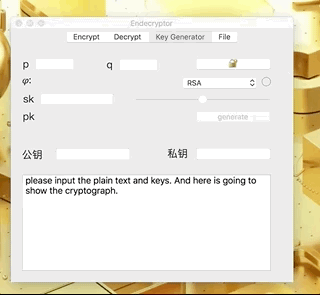

#Endecryption
It is a tiny demo of implementation of some encryption and decryption algorithm.

##Introduction
***Yes. It is simple and valueless. I write this just for giving some inspiration for the homework to those who will take the lesson taught by Li Hui in BUCT.***

This tiny program can encrypt plaintext with `affine cipher`, `multiplication cipher`, `vingenère`, `rsa`, `des` and `md5`(actually it isn't an encryption way, but I put it in encryption just to be simple to implenment).

And also can decrypt plaintext with `affine cipher`, `multiplication cipher`, `vingenère`, `rsa` and `des`.

Both encryption and decryption type listed above can be done with file.

##How to use
In this demo. There are 4 views which have respective functions. They are `encrypt`, `decrypt`, `key generate` and `file`.(yah..maybe the names may confuse you, and I admit the name isn't so accuracy..)

For each action Type. There are several encrypt or decrypt type. You can choose a type and input some strings acting as plaintext(or cryptograph, depending on you are doing a encryption or decryption) and see the encryption result(or decryption result).

####example: 
encrypt and decrypt `hello world` with affine cipher.

  

note that affine cipher takes to integer value as key. And I input 11 and 7 here.

genrate keys for rsa encryption and decryption.

